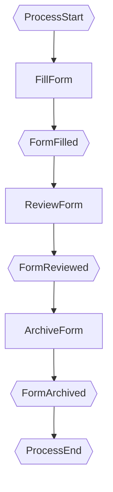
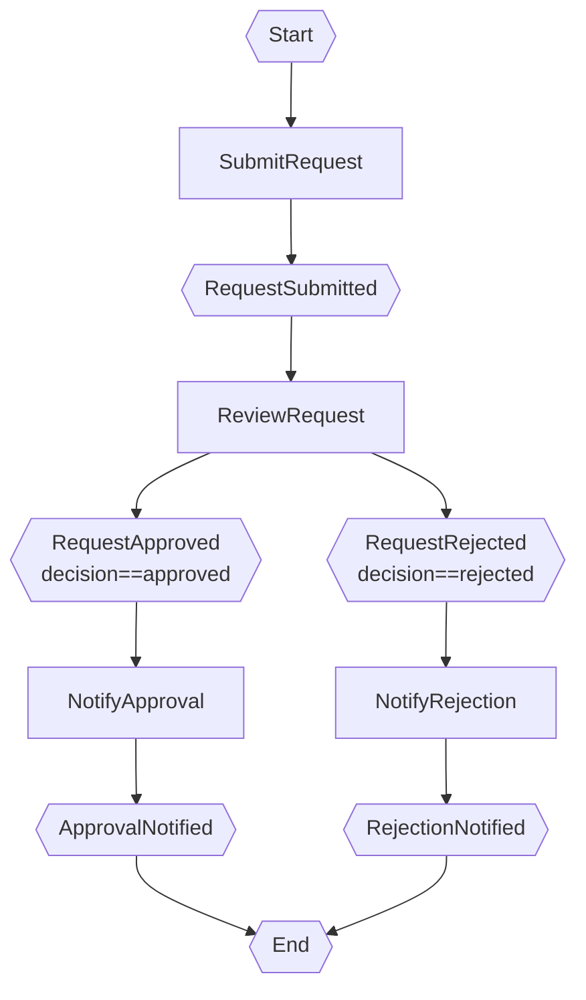

# BPMN_DSL_v1 — Примеры использования текстового DSL2 для формализации BPMN

## Введение

DSL2 — текстовый язык описания бизнес-процессов в нотации EPC2 (расширенная нотация EPC).  
DSL2 позволяет:
- описать процесс в человекочитаемом тексте;
- автоматически сгенерировать BPMN/EPC2-схему (через Mermaid);
- скомпилировать в исполняемый JavaScript;
- конвертировать в XState, Petri-net и другие форматы (см. `xstate_petri_analysis.md`).

---

## Соответствие элементов BPMN и DSL2

| BPMN | EPC2 / DSL2 | Описание |
|---|---|---|
| Start Event | `start:` | Начальное событие процесса |
| End Event | `end:` | Конечное событие |
| Task / User Task | `function ... role: User` | Функция, выполняемая пользователем |
| Service Task | `function ... role: System` | Автоматическая функция |
| Exclusive Gateway (XOR) | Несколько `event` с `condition:` | XOR-разветвление через условия событий |
| Sequence Flow | `next: <FunctionName>` | Переход к следующей функции |
| Data Object | `documents:` | Документ в одном из состояний |
| Lane / Pool | `roles:` + `role:` у функции | Роль, привязанная к полосе |
| Intermediate Event | `event:` в `on_complete:` | Событие при завершении функции |

---

## Пример 1: Простой линейный процесс (3 задачи)

### Схема BPMN

```
[Start] → [Task A: Applicant] → [Task B: Manager] → [Task C: System] → [End]
```

### DSL2

```dsl2
process LinearProcess:
  title: "Линейный процесс"

  documents:
    Form:
      states:
        - blank
        - filled
        - reviewed
        - archived
      transitions:
        blank --> filled --> reviewed --> archived

  roles:
    - Applicant
    - Manager
    - System

  workflow:
    start: ProcessStart

    steps:
      - function FillForm:
          role: Applicant
          system: WebForm
          input_doc:
            - Form.blank
          output_doc:
            - Form.filled
          on_complete:
            - event: FormFilled
              next: ReviewForm

      - function ReviewForm:
          role: Manager
          system: WebForm
          input_doc:
            - Form.filled
          output_doc:
            - Form.reviewed
          on_complete:
            - event: FormReviewed
              next: ArchiveForm

      - function ArchiveForm:
          role: System
          system: ArchiveService
          input_doc:
            - Form.reviewed
          output_doc:
            - Form.archived
          on_complete:
            - event: FormArchived
              next: end

    end: ProcessEnd
```

### Сгенерированная Mermaid-схема



---

## Пример 2: XOR-разветвление (одобрение / отклонение)

### Схема BPMN

```
[Start] → [Submit: Applicant] → [Review: Manager] →
    [Approved?] → yes → [Notify Approval: System] → [End]
              ↓ no
         [Notify Rejection: System] → [End]
```

### DSL2

```dsl2
process ApprovalProcess:
  title: "Процесс одобрения"

  documents:
    Request:
      states:
        - draft
        - submitted
        - approved
        - rejected
      transitions:
        draft --> submitted --> approved
        submitted --> rejected

  roles:
    - Applicant
    - Manager
    - System

  workflow:
    start: Start

    steps:
      - function SubmitRequest:
          role: Applicant
          system: WebForm
          input_doc:
            - Request.draft
          output_doc:
            - Request.submitted
          on_complete:
            - event: RequestSubmitted
              next: ReviewRequest

      - function ReviewRequest:
          role: Manager
          system: WebForm
          input_doc:
            - Request.submitted
          output_doc:
            - Request.approved
            - Request.rejected
          on_complete:
            - event: RequestApproved
              condition: "decision == 'approved'"
              output_doc: Request.approved
              next: NotifyApproval
            - event: RequestRejected
              condition: "decision == 'rejected'"
              output_doc: Request.rejected
              next: NotifyRejection

      - function NotifyApproval:
          role: System
          system: NotificationService
          input_doc:
            - Request.approved
          on_complete:
            - event: ApprovalNotified
              next: end

      - function NotifyRejection:
          role: System
          system: NotificationService
          input_doc:
            - Request.rejected
          on_complete:
            - event: RejectionNotified
              next: end

    end: End
```

### Mermaid EPC2 (XOR-разветвление)



---

## Пример 3: Многоуровневое согласование (цепочка одобрений)

### DSL2

```dsl2
process MultiApproval:
  title: "Многоуровневое согласование"

  documents:
    Contract:
      states:
        - draft
        - dept_approved
        - legal_approved
        - ceo_approved
        - rejected
      transitions:
        draft --> dept_approved --> legal_approved --> ceo_approved
        dept_approved --> rejected
        legal_approved --> rejected
        ceo_approved --> rejected

  roles:
    - Author
    - DeptHead
    - LegalAdvisor
    - CEO
    - System

  workflow:
    start: ContractStart

    steps:
      - function PrepareContract:
          role: Author
          system: DocEditor
          input_doc:
            - Contract.draft
          output_doc:
            - Contract.draft
          on_complete:
            - event: ContractPrepared
              next: ApproveDept

      - function ApproveDept:
          role: DeptHead
          system: ApprovalSystem
          input_doc:
            - Contract.draft
          output_doc:
            - Contract.dept_approved
            - Contract.rejected
          on_complete:
            - event: DeptApproved
              condition: "decision == 'approved'"
              output_doc: Contract.dept_approved
              next: ApproveLegal
            - event: DeptRejected
              condition: "decision == 'rejected'"
              output_doc: Contract.rejected
              next: NotifyRejection

      - function ApproveLegal:
          role: LegalAdvisor
          system: ApprovalSystem
          input_doc:
            - Contract.dept_approved
          output_doc:
            - Contract.legal_approved
            - Contract.rejected
          on_complete:
            - event: LegalApproved
              condition: "decision == 'approved'"
              output_doc: Contract.legal_approved
              next: ApproveCEO
            - event: LegalRejected
              condition: "decision == 'rejected'"
              output_doc: Contract.rejected
              next: NotifyRejection

      - function ApproveCEO:
          role: CEO
          system: ApprovalSystem
          input_doc:
            - Contract.legal_approved
          output_doc:
            - Contract.ceo_approved
            - Contract.rejected
          on_complete:
            - event: CEOApproved
              condition: "decision == 'approved'"
              output_doc: Contract.ceo_approved
              next: NotifyApproval
            - event: CEORejected
              condition: "decision == 'rejected'"
              output_doc: Contract.rejected
              next: NotifyRejection

      - function NotifyApproval:
          role: System
          system: NotificationService
          input_doc:
            - Contract.ceo_approved
          on_complete:
            - event: ApprovalNotified
              next: end

      - function NotifyRejection:
          role: System
          system: NotificationService
          input_doc:
            - Contract.rejected
          on_complete:
            - event: RejectionNotified
              next: end

    end: ContractEnd
```

---

## Генерация схемы по DSL и наоборот

### DSL → Схема (прямое направление)

1. Напишите DSL2-текст в редакторе (вкладка **DSL Source**).
2. Нажмите **«⟳ Перетранслировать и перезапустить»**.
3. Перейдите на вкладку **EPC2 Диаграмма** — схема сгенерирована автоматически.

### Схема → DSL (обратное направление)

По Mermaid-схеме EPC2 можно восстановить DSL2:

1. Каждый прямоугольник `[FunctionName]` → `- function FunctionName:`
2. Каждый шестиугольник `{{EventName}}` → запись в `on_complete: - event: EventName`
3. Стрелка `F1 --> E1 --> F2` → `next: F2` внутри события `E1` функции `F1`
4. Условие на событии → `condition:` в `on_complete`
5. Параллелограмм (документ) → запись в `documents:` и `input_doc:`/`output_doc:`
6. Круг (роль) → `role:` внутри функции и запись в `roles:`

---

## Соответствие BPMN-шаблонов и конструкций DSL2

| BPMN-шаблон | DSL2-конструкция |
|---|---|
| Последовательность задач | Цепочка `function` с `next:` |
| XOR-разветвление | Несколько `on_complete` с `condition:` |
| Системная задача (автомат) | `role: System` |
| Документ / Data Object | `documents:` + `input_doc:`/`output_doc:` |
| Swimlane / Pool | `roles:` + `role:` у каждой функции |
| End Event | `next: end` |
| Конечное состояние документа | Последнее состояние в `transitions:` |
