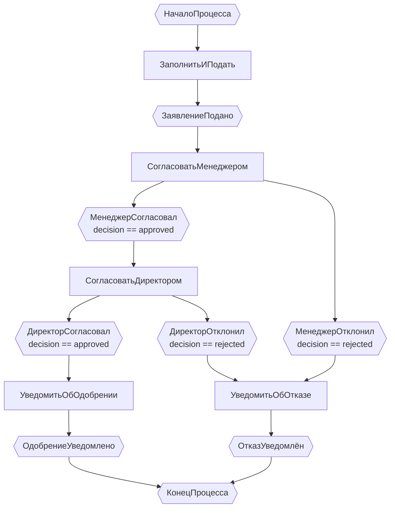
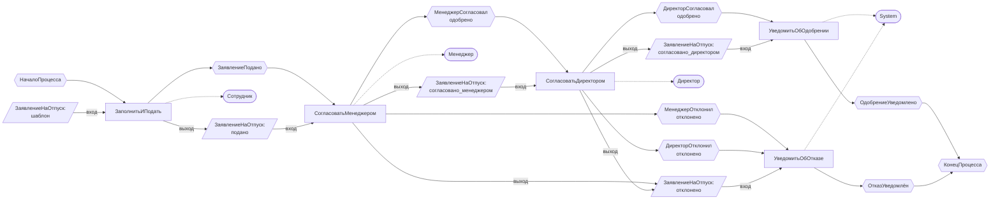
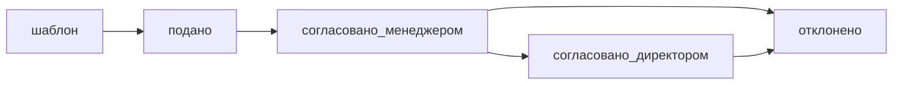

# EPC2 Диаграмма: Согласование заявления на отпуск

## Диаграмма Workflow (Mermaid)

## Полная схема EPC2 (Workflow + Docflow + Роли)

## Переходы состояний документов (нотация mermaid)

> **Пояснение:** Состояние `отклонено` достижимо из двух состояний:
> `согласовано_менеджером` (при отказе менеджера) и `согласовано_директором` (при отказе директора).

## Примечания к применённым правилам EPC2

1. **Отсутствуют явные шлюзы AND/OR/XOR** — условия находятся внутри шестиугольников событий.
2. **XOR-разветвление** на `СогласоватьМенеджером`: `МенеджерСогласовал` и `МенеджерОтклонил` — взаимоисключающие (решение может быть только «одобрено» ИЛИ «отклонено»).
3. **XOR-разветвление** на `СогласоватьДиректором`: та же схема.
4. **Документальные потоки** показаны на **западной (левой) стороне** каждой функции в виде параллелограммов со стрелками.
5. **Роли** показаны на **восточной (правой) стороне** каждой функции штриховыми линиями связи.
6. Обе функции `УведомитьОбОдобрении` и `УведомитьОбОтказе` сходятся к одному `КонецПроцесса` — неявное XOR-слияние (за один экземпляр срабатывает только один путь).
