# Анализ представления процесса DSL2 в XState и сетях Петри

На примере `example_epc2_ru.md` (процесс «Согласование заявления на отпуск»).

---

## 1. Представление в XState

### Что такое XState

XState — библиотека JavaScript/TypeScript для конечных автоматов (Finite State Machine, FSM) и иерархических автоматов. Процесс описывается как JSON/JS-объект, а выполняется как интерпретируемый автомат.

### Компиляция DSL2 → XState

DSL2 можно скомпилировать в определение машины состояний XState (JSON).  
Каждая **функция** DSL2 отображается в **состояние** XState, каждое **событие** — в **переход** (transition).

### Пример XState JSON для процесса «Согласование заявления на отпуск»

```json
{
  "id": "ОтпускСогласование",
  "initial": "ЗаполнитьИПодать",
  "context": {
    "docState": "шаблон",
    "decision": null
  },
  "states": {
    "ЗаполнитьИПодать": {
      "meta": {
        "role": "Сотрудник",
        "system": "WebForm",
        "input_doc": ["ЗаявлениеНаОтпуск.шаблон"],
        "output_doc": ["ЗаявлениеНаОтпуск.подано"]
      },
      "on": {
        "ЗаявлениеПодано": {
          "target": "СогласоватьМенеджером",
          "actions": [{ "type": "setDocState", "docState": "подано" }]
        }
      }
    },
    "СогласоватьМенеджером": {
      "meta": {
        "role": "Менеджер",
        "system": "WebForm",
        "input_doc": ["ЗаявлениеНаОтпуск.подано"],
        "output_doc": ["ЗаявлениеНаОтпуск.согласовано_менеджером", "ЗаявлениеНаОтпуск.отклонено"]
      },
      "on": {
        "МенеджерСогласовал": {
          "target": "СогласоватьДиректором",
          "guard": "isApproved",
          "actions": [{ "type": "setDocState", "docState": "согласовано_менеджером" }]
        },
        "МенеджерОтклонил": {
          "target": "УведомитьОбОтказе",
          "guard": "isRejected",
          "actions": [{ "type": "setDocState", "docState": "отклонено" }]
        }
      }
    },
    "СогласоватьДиректором": {
      "meta": {
        "role": "Директор",
        "system": "WebForm",
        "input_doc": ["ЗаявлениеНаОтпуск.согласовано_менеджером"],
        "output_doc": ["ЗаявлениеНаОтпуск.согласовано_директором", "ЗаявлениеНаОтпуск.отклонено"]
      },
      "on": {
        "ДиректорСогласовал": {
          "target": "УведомитьОбОдобрении",
          "guard": "isApproved",
          "actions": [{ "type": "setDocState", "docState": "согласовано_директором" }]
        },
        "ДиректорОтклонил": {
          "target": "УведомитьОбОтказе",
          "guard": "isRejected",
          "actions": [{ "type": "setDocState", "docState": "отклонено" }]
        }
      }
    },
    "УведомитьОбОдобрении": {
      "meta": {
        "role": "System",
        "system": "NotificationService",
        "input_doc": ["ЗаявлениеНаОтпуск.согласовано_директором"]
      },
      "on": {
        "ОдобрениеУведомлено": { "target": "КонецОдобрение" }
      }
    },
    "УведомитьОбОтказе": {
      "meta": {
        "role": "System",
        "system": "NotificationService",
        "input_doc": ["ЗаявлениеНаОтпуск.отклонено"]
      },
      "on": {
        "ОтказУведомлён": { "target": "КонецОтказ" }
      }
    },
    "КонецОдобрение": { "type": "final" },
    "КонецОтказ":    { "type": "final" }
  }
}
```

### Guards (охранники) для условий

```js
const guards = {
  isApproved: (context) => context.decision === 'approved',
  isRejected: (context) => context.decision === 'rejected'
};
```

### Инициализация и запуск XState-машины (JavaScript)

```js
import { createMachine, interpret } from 'xstate';

const machine = createMachine(xstateDefinition, { guards });

const service = interpret(machine).onTransition(state => {
  console.log('Текущее состояние:', state.value);
  console.log('Контекст:', state.context);
});

service.start();
// Отправляем событие с решением
service.send({ type: 'МенеджерСогласовал', decision: 'approved' });
```

---

## 2. Как показываются сети workflow и docflow и их синхронизация (XState)

### Подход: иерархическая машина (parallel states)

Workflow (поток управления) и Docflow (поток документов) — два параллельных автомата, синхронизированных через общий контекст.

```json
{
  "id": "ОтпускСогласование_Параллельный",
  "type": "parallel",
  "states": {
    "workflow": {
      "initial": "ЗаполнитьИПодать",
      "states": {
        "ЗаполнитьИПодать": {
          "on": { "ЗаявлениеПодано": "СогласоватьМенеджером" }
        },
        "СогласоватьМенеджером": {
          "on": {
            "МенеджерСогласовал": "СогласоватьДиректором",
            "МенеджерОтклонил": "УведомитьОбОтказе"
          }
        },
        "СогласоватьДиректором": {
          "on": {
            "ДиректорСогласовал": "УведомитьОбОдобрении",
            "ДиректорОтклонил": "УведомитьОбОтказе"
          }
        },
        "УведомитьОбОдобрении": { "on": { "ОдобрениеУведомлено": "Завершён" } },
        "УведомитьОбОтказе":    { "on": { "ОтказУведомлён": "Завершён" } },
        "Завершён": { "type": "final" }
      }
    },
    "docflow": {
      "initial": "шаблон",
      "states": {
        "шаблон": { "on": { "ЗаявлениеПодано": "подано" } },
        "подано": {
          "on": {
            "МенеджерСогласовал": "согласовано_менеджером",
            "МенеджерОтклонил": "отклонено"
          }
        },
        "согласовано_менеджером": {
          "on": {
            "ДиректорСогласовал": "согласовано_директором",
            "ДиректорОтклонил": "отклонено"
          }
        },
        "согласовано_директором": { "on": { "ОдобрениеУведомлено": "архив" } },
        "отклонено": { "on": { "ОтказУведомлён": "архив" } },
        "архив": { "type": "final" }
      }
    }
  }
}
```

**Синхронизация:** одно и то же событие (например, `МенеджерСогласовал`) переключает сразу оба автомата — workflow переходит в `СогласоватьДиректором`, а docflow в `согласовано_менеджером`.

---

## 3. Представление в сети Петри (Petri Net)

### Основные понятия

| Элемент сети Петри | Соответствие в DSL2 |
|---|---|
| **Место (Place)** | Состояние workflow (перед/после функции) или состояние документа |
| **Переход (Transition)** | Функция (`function`) или событие (`event`) |
| **Маркер (Token)** | Текущее местонахождение управления (workflow) или документа (docflow) |
| **Дуга (Arc)** | Стрелки `input_doc`, `output_doc`, `next:` |

### Схема сети Петри для процесса (нотация mermaid)

```mermaid
flowchart LR
    %% Места (Places) workflow
    P_start([НачалоПроцесса])
    P_before_fill([до_ЗаполнитьИПодать])
    P_before_manager([до_СогласоватьМенеджером])
    P_before_director([до_СогласоватьДиректором])
    P_before_notify_ok([до_УведомитьОбОдобрении])
    P_before_notify_reject([до_УведомитьОбОтказе])
    P_end([КонецПроцесса])

    %% Переходы (Transitions) workflow
    T_fill[ЗаполнитьИПодать]
    T_manager[СогласоватьМенеджером]
    T_director[СогласоватьДиректором]
    T_notify_ok[УведомитьОбОдобрении]
    T_notify_reject[УведомитьОбОтказе]

    %% Дуги workflow
    P_start --> T_fill --> P_before_manager
    P_before_manager --> T_manager
    T_manager -->|approved| P_before_director
    T_manager -->|rejected| P_before_notify_reject
    P_before_director --> T_director
    T_director -->|approved| P_before_notify_ok
    T_director -->|rejected| P_before_notify_reject
    P_before_notify_ok --> T_notify_ok --> P_end
    P_before_notify_reject --> T_notify_reject --> P_end

    %% Места docflow
    D_template([шаблон•])
    D_submitted([подано])
    D_mgr_ok([согласовано_менеджером])
    D_dir_ok([согласовано_директором])
    D_rejected([отклонено])

    %% Дуги docflow (синхронизация с workflow-переходами)
    D_template -->|in| T_fill -->|out| D_submitted
    D_submitted -->|in| T_manager
    T_manager -->|approved out| D_mgr_ok
    T_manager -->|rejected out| D_rejected
    D_mgr_ok -->|in| T_director
    T_director -->|approved out| D_dir_ok
    T_director -->|rejected out| D_rejected
```



> **•** — маркер в начальном месте.

### Правила срабатывания (firing rules) для DSL2

1. Переход (функция) **срабатывает**, если:
   - в его входном месте (workflow) есть маркер **И**
   - в его входном месте (docflow) есть маркер документа нужного состояния.

2. После срабатывания:
   - маркер убирается из входного места workflow, добавляется в выходное;
   - маркер документа переходит из входного состояния в выходное (согласно `output_doc`);
   - синхронно.

3. Событие-фильтр (условие-событие):
   - если условие `false` → маркер **удаляется** (фильтр);
   - если условие `true` → маркер **переходит** в следующее место.

---

## 4. Использование petri-net-runner / pflow

### pflow (библиотека)

`pflow` — JavaScript-библиотека для исполнения сетей Петри в браузере/Node.js.  
DSL2 можно скомпилировать в формат pflow следующим образом:

```js
const pflow = {
  places: {
    // workflow places
    'start': { initial: 1 },
    'before_fill': { initial: 0 },
    'before_manager': { initial: 0 },
    'before_director': { initial: 0 },
    'before_notify_ok': { initial: 0 },
    'before_notify_reject': { initial: 0 },
    'end': { initial: 0 },
    // docflow places
    'doc_template': { initial: 1 },
    'doc_submitted': { initial: 0 },
    'doc_mgr_approved': { initial: 0 },
    'doc_dir_approved': { initial: 0 },
    'doc_rejected': { initial: 0 }
  },
  transitions: {
    'FillAndSubmit': {
      delta: {
        'start': -1, 'before_manager': +1,
        'doc_template': -1, 'doc_submitted': +1
      }
    },
    'ApproveByManager_approved': {
      delta: {
        'before_manager': -1, 'before_director': +1,
        'doc_submitted': -1, 'doc_mgr_approved': +1
      },
      guard: (ctx) => ctx.decision === 'approved'
    },
    'ApproveByManager_rejected': {
      delta: {
        'before_manager': -1, 'before_notify_reject': +1,
        'doc_submitted': -1, 'doc_rejected': +1
      },
      guard: (ctx) => ctx.decision === 'rejected'
    },
    'ApproveByDirector_approved': {
      delta: {
        'before_director': -1, 'before_notify_ok': +1,
        'doc_mgr_approved': -1, 'doc_dir_approved': +1
      },
      guard: (ctx) => ctx.decision === 'approved'
    },
    'ApproveByDirector_rejected': {
      delta: {
        'before_director': -1, 'before_notify_reject': +1,
        'doc_mgr_approved': -1, 'doc_rejected': +1
      },
      guard: (ctx) => ctx.decision === 'rejected'
    },
    'NotifyApproval': {
      delta: { 'before_notify_ok': -1, 'end': +1 }
    },
    'NotifyRejection': {
      delta: { 'before_notify_reject': -1, 'end': +1 }
    }
  }
};
```

---

## 5. Сравнение подходов

| Критерий | XState | Сеть Петри (pflow) | DSL2 (текущий движок) |
|---|---|---|---|
| Читаемость определения | Средняя (JSON) | Низкая (delta) | Высокая (YAML-like) |
| Параллельные потоки | Через `parallel` states | Нативно (несколько маркеров) | Не поддерживается |
| Условные переходы | `guard` функции | `guard` функции | `condition:` строка |
| Инструментарий | Обширный (devtools, visualizer) | Ограниченный | Минимальный (встроенный) |
| Синхронизация workflow+docflow | Через общий контекст | Нативно (совместные дуги) | Через `output_doc` в событии |
| Воспроизводимость | Да (сериализация) | Да (marking вектор) | Да (history массив) |
| Интеграция в браузере | Легко (npm пакет) | Легко (npm пакет) | Нативно (без зависимостей) |

### Рекомендации

- **XState** — рекомендуется для сложных иерархических процессов, где нужна мощь инструментария и визуализации.
- **Petri Net (pflow)** — рекомендуется при наличии параллельных потоков и сложных условий синхронизации (например, AND-join).
- **DSL2 (текущий движок)** — достаточен для линейных и XOR-разветвлённых процессов; прост в освоении.

---

## 6. Вывод

DSL2 служит читаемым фронтендом для описания процессов. Из одного DSL2-файла можно автоматически сгенерировать:

1. **EPC2 диаграмму** (Mermaid) — для визуализации
2. **Исполняемый JS** (текущий движок) — для симуляции прямо в браузере
3. **XState JSON** — для интеграции в React/Vue/Angular приложения
4. **Petri Net (pflow)** — для формального анализа корректности (достижимость, живость, безопасность)
5. **BPMN XML** — для загрузки в Camunda, Activiti и другие BPMN-движки
